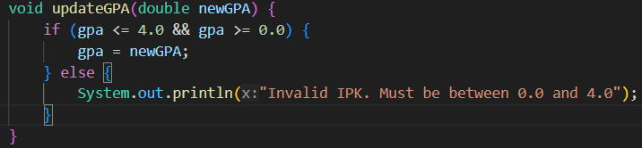
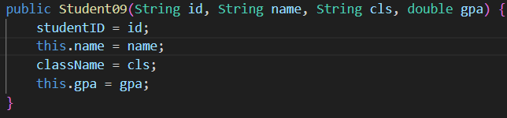
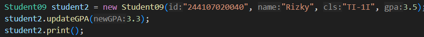
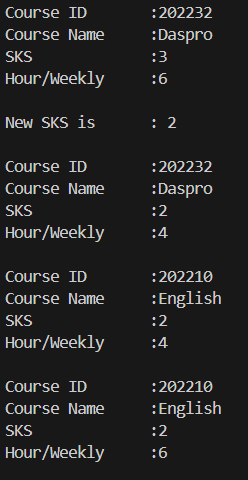
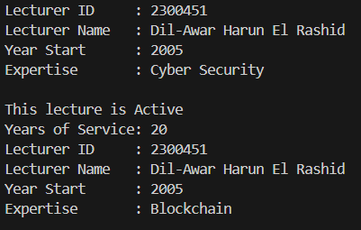

|  | Algorithm and Data Structure |
|--|--|
| NIM |  244107020229|
| Nama |  Dil-Awar Harun El Rashid |
| Kelas | TI - 1I |
| Repository | [link] () |

# Labs #1 Programming Fundamentals Review

## 2.1.3 Questions

1. -Two characteristics of a class.
    It defines object properties and behaviors, and that it serves as a blueprint for objects.
   -Two characteristics of an object. 
    it has identity, and behavior. 

2. -Student class have 4 attributes: 
    String studentID
    String name
    String className
    double gpa
3. -Student class have 4 methods:
    print
    changeClass
    updateGPA
    evaluate
4. 
5. evaluate() method will evaluate based on gpa if beetwen 4.0 and 3.5 the output will be exelent, if beetwen 3.5 and 3.0 the output will be good, if beetwen 3.0 and 2.0 the output will be fair, if between 2.0 and 0.0 the output will be poor.

## 2.2.3 Questions

1. Student09 student1 = new Student09(); 
    the name of the created object is student1
2. with call the variable of attributes and methods at the main functions. 
3. Because at below first print(), the data is updated with variable changeClass and updateGPA.

## 2.3.3 Questions

1. 
2. It create a new object which is student2 that have different attributes with student1.
3. the program cannot be run because, there is parametic constructor, so we need default constructor to make a new object with default constructor in Main.
4. no, because we can just called the method that we want to call just with write the object first and then dot(.) the name of the method that we want to call
5. 

## Assignment
Course

Lecturer

